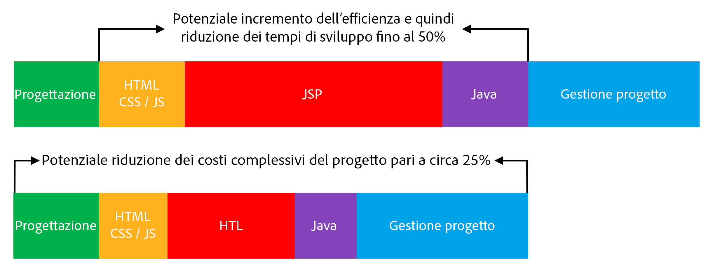

# Panoramica {#overview}

L’obiettivo di HTL (HTML Template Language) supportato da Adobe Experience Manager (AEM) è offrire un framework web di livello Enterprise a produttività elevata che aumenti la sicurezza e consenta agli sviluppatori HTML senza conoscenze Java di partecipare in modo migliore ai progetti AEM.

HTML Template Language è il sistema di modelli lato server preferito e consigliato per HTML in AEM. HTL è stato introdotto con AEM 6.0 e sostituisce JSP (JavaServer Pages). HTML Template Language supporta gli sviluppatori web nella creazione di siti web aziendali affidabili, aumentando la sicurezza e l’efficienza dello sviluppo.

## Maggiore sicurezza {#increased-security}

Rispetto a JSP e alla maggior parte degli altri sistemi basati su modelli, HTML Template Language aumenta la sicurezza dei siti in cui viene implementato in quanto è in grado di applicare automaticamente gli escape adeguati in base al contesto a tutte le variabili che vengono inviate al livello della presentazione. Tutto ciò è possibile in quanto HTL comprende la sintassi HTML e utilizza tale conoscenza per modificare l’escape necessario per le espressioni in base alla loro posizione nell’ordine di markup. Ciò si traduce, ad esempio, in espressioni posizionate in attributi `href` o `src` con un escape diverso rispetto a quelle posizionate in altri attributi o altrove.

Sebbene sia possibile ottenere lo stesso risultato con i linguaggi basati su modelli come JSP, con questi ultimi lo sviluppatore deve accertarsi manualmente che l’escape corretto venga applicato a ogni variabile. Poiché una sola omissione o un singolo errore nell’escape applicato potrebbe causare una vulnerabilità cross-site scripting (XSS), abbiamo deciso di automatizzare questa attività con HTL. Se necessario, gli sviluppatori possono comunque specificare un escape diverso sulle espressioni. Con HTL, tuttavia, è molto più probabile che il comportamento predefinito corrisponda a quello desiderato, riducendo la probabilità di errori.

## Sviluppo semplificato {#simplified-development}

HTML Template Language è facile da imparare e presenta funzioni appositamente limitate per garantirne la semplicità. Dispone inoltre di potenti meccanismi per strutturare la logica di markup e chiamata, applicando costantemente una rigida separazione delle questioni di markup e logica. HTL è un linguaggio HTML5 standard: utilizza, infatti, espressioni e attributi di dati per annotare il markup con il comportamento dinamico desiderato; questo significa che non interrompe la validità del markup, mantenendolo leggibile. Tieni presente che la valutazione delle espressioni e degli attributi dei dati viene eseguita interamente sul lato server e non sarà visibile sul client, dove è possibile utilizzare qualsiasi framework JavaScript senza creare interferenze.

Queste funzionalità consentono agli sviluppatori HTML senza conoscenze Java e con poche conoscenze specifiche del prodotto di modificare i modelli HTL e far parte del team di sviluppo, semplificando in tal modo la collaborazione con gli sviluppatori Java. Inoltre, HTM consente agli sviluppatori Java di concentrarsi sul codice di back-end senza preoccuparsi dell’HTML.

## Costi ridotti {#reduced-costs}

Una maggiore sicurezza, uno sviluppo semplificato e una migliore collaborazione in team si traducono, per i progetti AEM, in maggiore efficienza, tempi di realizzazione più rapidi e una riduzione del costo totale di proprietà.

In concreto, considerando i dati registrati durante la reimplementazione del sito Adobe.com con HTML Template Language, si possono ridurre di circa il 25% sia i costi che la durata del progetto.

Il diagramma precedente mostra potenziali miglioramenti in termini di efficienza resi possibili da HTL:

* **HTML/CSS/JS:** poiché gli sviluppatori HTML possono modificare direttamente i modelli HTL, i progetti front-end non devono più essere implementati separatamente dal progetto AEM, ma possono essere implementati direttamente sui componenti AEM effettivi. Questo riduce la necessità di coinvolgere ripetutamente gli sviluppatori Java.
* **JSP/HTL:** poiché il linguaggio HTL non richiede alcuna conoscenza Java ed è di facile scrittura, qualsiasi sviluppatore con esperienza HTML è in grado di modificare i modelli.
* **Java:** grazie alla semplicità d’uso dell’API di utilizzo fornita da HTL, l’interfaccia con la logica di business diventa limpida, andando anche a beneficio dello sviluppo Java in generale.

**Articolo successivo:**

* [Guida introduttiva a HTML Template Language](getting-started.md)
